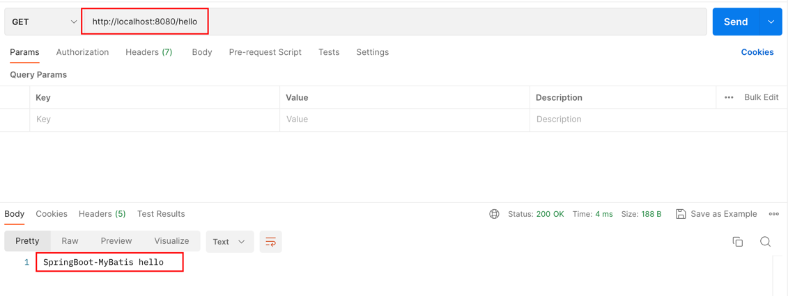
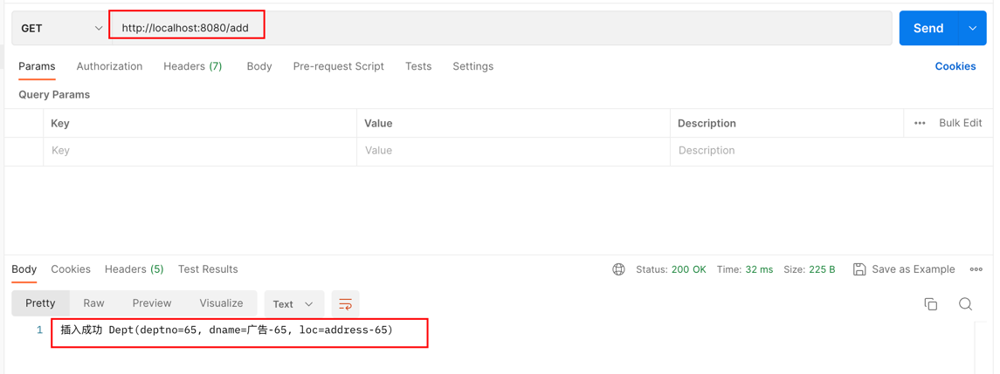
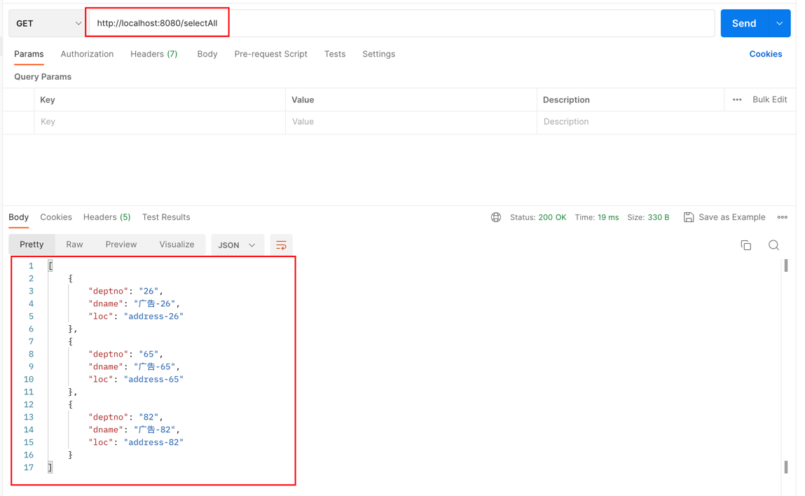
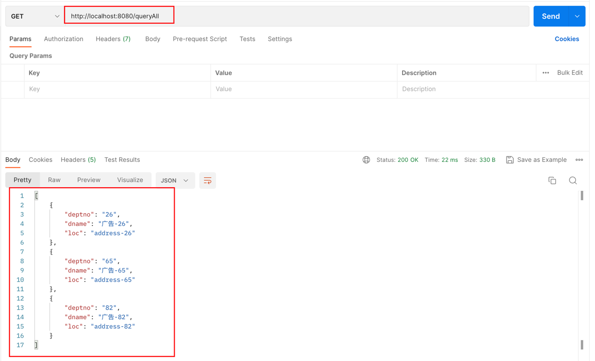

# 1. 项目说明
这是一个Springboot整合mybatis的环境，搭建了基础框架，能跑得通，方便快速进行一些验证性的试验操作

# 2. 组件版本
 | 组件                | 版本     |
|-------------------|--------|
 | springboot        | 3.2.3  |
| mysql-connector-j | 8.3.0  |
| mybatis           | 3.0.3  |
| mysql             | 8.0.28 |
| JDK               | 17     |

# 3. 表结构
```mysql
create table dept(
	`deptno` VARCHAR(20) NOT NULL,
	`dname` VARCHAR(100) NULL DEFAULT NULL COMMENT '部门名称',
	`loc` VARCHAR(100) NULL DEFAULT NULL COMMENT '部门地址'
)
```

# 4. 接口示例
1. hello接口，说明web项目有正常启动运行


2. add接口，用向先数据库中插入数据


3. selectAll接口，Mapper接口通过@Select注解的方式返回所有数据
```java
@Select("select * from dept")
List<Dept> selectAll();
```   


4. queryAll接口，通过DeptMapper.xml提供select返回所有数据
```xml
<select id="queryAll" resultMap="BaseResultMap">
    select <include refid="Base_Column_List" /> from dept
</select>
```

